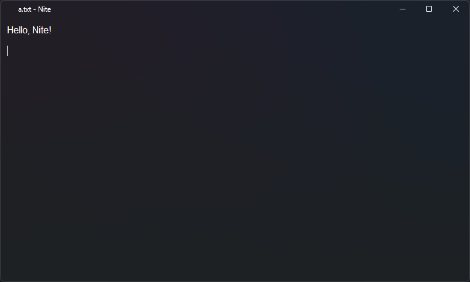
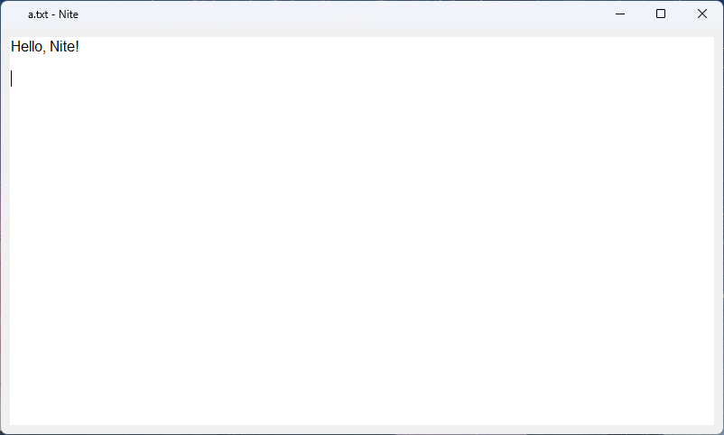

# Nite

Nite is a ultra-simple tool for editing text files fast. 

### ⚠️ Nite is not a full text editor. It can only be used for modifying existing files.

For Windows version >=22000 automaticly uses dark Mica mode for app. Modify the code to disable it.

## Screenshots

